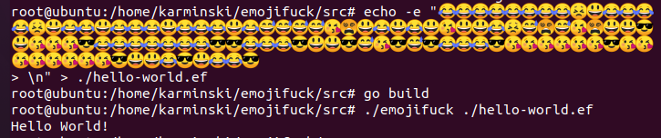

EmojiFuck 😎
------------

Just A Go language brainfuck interpreter, and I changed the brainfuck symbol to emoji.  

我把 Go 语言编写的 brainfuck 解释器的 brainfuck symbol 弄成了颜文字来滑稽一波.  

## How to run (如何运行)

```
echo -e "😂😂😂😂😂😂😂😂😣😃😂😂😂😂😣😃😂😂😃😂😂😂😃😂😂😂😃😂😅😅\
😅😅😘😵😃😂😃😂😃😘😃😃😂😣😅😵😅😘😵😃😃😎😃😘😘😘😎😂😂😂😂😂😂😂😎\
😎😂😂😂😎😃😃😎😅😘😎😅😎😂😂😂😎😘😘😘😘😘😘😎😘😘😘😘😘😘😘😘😎😃😃\
😂😎😃😂😂😎\n" > hello-world.ef;
go build;
./emojifuck ./hello-world.ef;
```




## How to modify your personal emojifuck (自定义你的 EmojiFuck)

In the src/main.go, change these lines to emoji what you want:  
(修改 src/main.go 文件中的下面这些行就可以了:)  

```
// config your emoji symbol here
const (
    SYMBOL_INC_DP  = '😃' // >
    SYMBOL_DEC_DP  = '😅' // <
    SYMBOL_INC_VAL = '😂' // +
    SYMBOL_DEC_VAL = '😘' // -
    SYMBOL_OUT     = '😎' // .
    SYMBOL_IN      = '😨' // ,
    SYMBOL_JMP_FWD = '😣' // [
    SYMBOL_JMP_BCK = '😵' // ]
)
```

